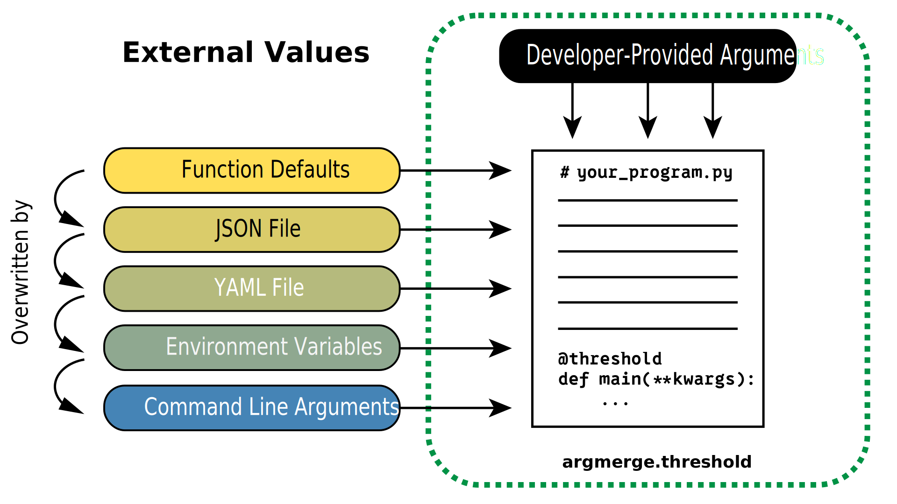

---
date:
  created: 2024-01-01
---

# `argmerge`
## Description
_Customize how program defaults and overrides from config files, environment variables, and CLI arguments "cross the threshold" into your program._



We retrieve each possible source of program arguments as Python dictionaries and then perform dictionary updates between each source before passing the final dictionary to the wrapped function. Effectively:
```py
source_1: dict
source_2: dict

source_1.update(source_2)

function(**source_1)
```

## Installation
We recommend using [`uv` for package management](http://docs.astral.sh/uv/).
```sh
uv add argmerge
```

If you're using pip you can run
```sh
pip install argmerge
```

## Usage
### Code Example
While designed for `main` functions, you can ddd the `@threshold` decorator to any program that interfaces with external variables or files.
```py
from argmerge import threshold


@threshold
def main(first: int, second: str, third: float = 0.0):
    ...
```

### API Docs


I have some more words here