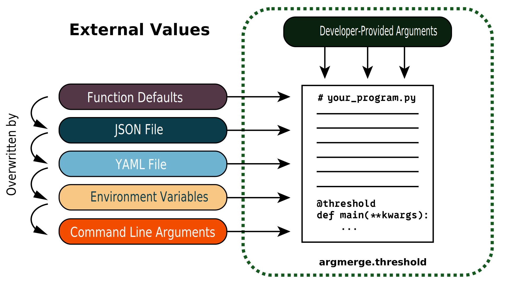

---
date:
  created: 2024-01-01
---

# `argmerge`
## Description
_Customize how program defaults and overrides from config files, environment variables, and CLI arguments "cross the threshold" into your program._



We retrieve each possible source of program arguments as Python dictionaries and then perform dictionary updates between each source before passing the final dictionary to the wrapped function. Effectively:
```py
source_1: dict
source_2: dict

source_1.update(source_2)

function(**source_1)
```

## Installation
We recommend using [`uv` for package management](http://docs.astral.sh/uv/).
```sh
uv add argmerge
```

If you're using pip you can run
```sh
pip install argmerge
```

## Usage
### Code Example
While designed for `main` functions, you can ddd the `@threshold` decorator to any program that interfaces with external variables or files.
```py
from argmerge import threshold


@threshold
def main(first: int, second: str, third: float = 0.0):
    ...
```

## Hierarchy
We determined the hierarchy based on (our perception of) developer experience. The intent is for higher priority sources to correspond to the quickest sources to change. For example, we perceive changing a CLI argument quicker than changing an environment variable - etc. 


| Level | Rank |
| --- | --- |
| Developer-provided | 100 |
| CLI | 40 |
| Environment Variable | 30 |
| YAML File | 20 |
| JSON File | 10 |
| Python Function Default | 0 |

## FAQ
#### Why YAML over JSON?
We prioritized YAML above JSON is because we find it significantly easier to read because it has less "line noise". JSON contains copious amounts of brackets (`{`,`}`) and commas. These are the only two sources that can pass dictionaries in by default. Of course, passing in different Regular expressions for environment variables and CLI arguments could also capture dictionaries, if you want to figure that out.